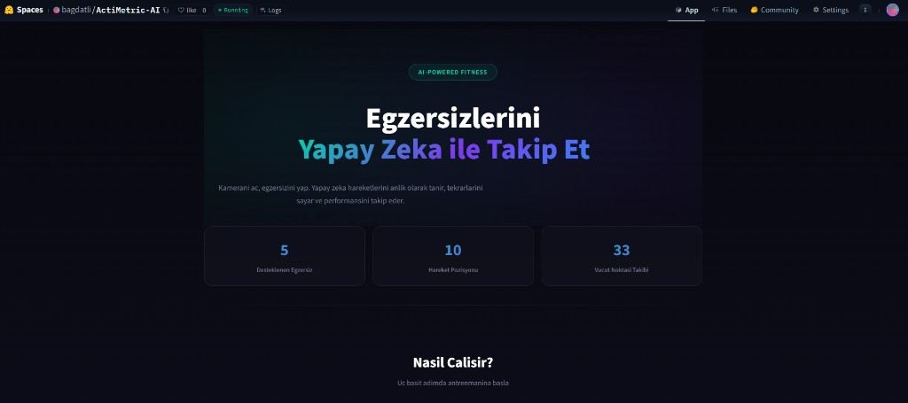
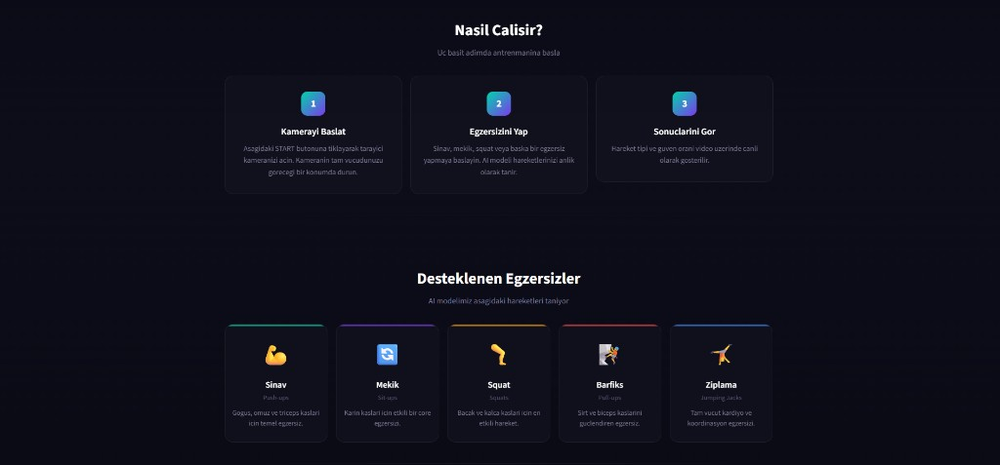

# NoPainNoGain

### AI-Powered Real-Time Exercise Tracking Platform

[](https://huggingface.co/spaces/bagdatli/ActiMetric-AI)

> **🚀 Instant Access:** No installation required. Click the banner above to test the real-time pose detection directly in your browser!

---

## About the Project

An **AI-powered real-time exercise recognition and analysis platform**.
Using your camera, the system analyzes body movements instantly and detects different exercise types.

### Current Features

* **Exercise Recognition**
  Automatically detects exercises such as **push-ups, sit-ups, squats, pull-ups, and jumping** using real-time camera input.

### Planned Features (v2)

* **Repetition Counting**
  Automatically counts the number of repetitions for each detected exercise.

* **Calorie Estimation**
  Estimates the calories burned based on the **exercise type, duration, and repetition count**.

---

# Approach

The project is designed as a **single integrated system**.

To achieve this goal:

* Projects that perform well in **sit-up detection**
* Projects that perform well in **push-up detection**
* Projects that perform well in **pull-up detection**
* Projects that perform well in **general action recognition**

were analyzed, their datasets were studied, and models were developed.

These subprojects will eventually be **combined into a single unified system**.
---

# Kaggle Exercise & Computer Vision Dataset Summary

| Topic                   | Competition / Dataset      | Data Content (Summary)                                                                        | Link   |
| ----------------------- | -------------------------- | --------------------------------------------------------------------------------------------- | ------ |
| **Calorie Expenditure** | Playground Series S5E5     | **Tabular:** Calorie estimation using pulse, duration, and body type data.                    | Kaggle |
| **Facial Keypoints**    | Facial Keypoints Detection | **Image:** $(x, y)$ coordinates of 15 facial landmarks.                                       | Kaggle |
| **Action Recognition**  | Human Action Recognition   | **Image:** 15 daily activity labels (running, walking, etc.).                                 | Kaggle |
| **Push-Up (LSTM)**      | Pushup Pose Detection      | **Time Series:** Joint coordinates extracted from push-up videos.                             | Kaggle |
| **Yoga Classification** | Yoga Pose Classification   | **Image:** Labeled images of 5 fundamental yoga poses.                                        | Kaggle |
| **Smart AI Coach**      | Exercise Recognition       | **Coordinate Data:** Motion data of 33 MediaPipe body landmarks.                              | Kaggle |
| **Exercise Prediction** | Multi-Class Exercise Poses | **Tabular:** 10 exercise poses (push-up, pull-up, sit-up, etc.) using MediaPipe 33 landmarks. | Kaggle |

---

## UI

|                                     |                                               |
| :---------------------------------: | :-------------------------------------------: |
|  |  |
|       Modern UI – Hero Section      |              Supported Exercises              |

---

## Folder Structure

```
BecameAPro/
├── CalorieExpenditurePrediction/
├── ExercisePrediction/          
│   ├── app/                
│   ├── src/                
│   ├── hf_space/           # Hugging Face Space deployment
│   └── models/             
├── FacialKeypointsDetection/
├── HumanActionRecognition/
├── LSTMExerciseClassificationPushUp/
├── SmartAICoach/
├── Yoga Pose Classification/
├── run_competition.py     
└── README.md
```

---

## Model Run

```bash
# Tum pipeline'i bastan calistir (notebook uzerinden)
python run_competition.py ExercisePrediction

# Lokal kamera demo (OpenCV penceresi)
cd ExercisePrediction
python -m src.camera_demo

# Streamlit web arayuzu (tarayici icinde WebRTC)
cd ExercisePrediction
streamlit run app/streamlit_app.py
```

---

## Technologies Used

### Core ML & AI

| Teknoloji              |
| ---------------------- |
| **MediaPipe**          |
| **XGBoost**            |
| **PyTorch**            |
| **TensorFlow / Keras** |
| **scikit-learn**       |

> The **ExercisePrediction** project is also being developed as an independent repository:
> https://github.com/ebagdatli/no-pain-no-gain
